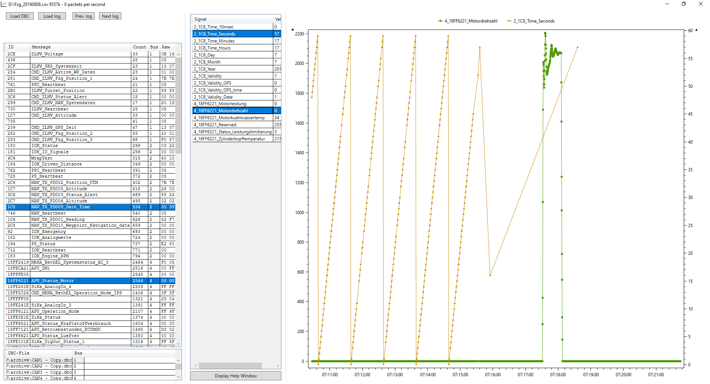

# CANBUS-Analyzer

This is a heavily modified Fork of [CANBUS-Analyzer](https://github.com/amund7/CANBUS-Analyzer) to display CAN-Traces as Graphs.

Traces in Vector-ASCII or SavvyCAN-CSV format can be loaded together with multiple dbc-files to display signals as graphs.

